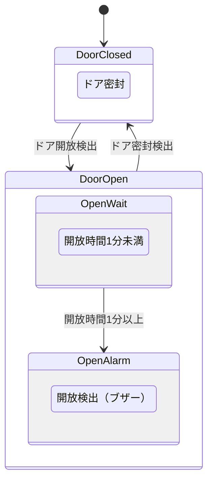

# 状態遷移

```mermaid
stateDiagram-v2
    [*] --> DoorClosed

    state DoorClosed {
        ドア密封
    }

    state DoorOpen {
        state OpenWait {
            開放時間1分未満
        }
        state OpenAlarm {
            開放検出（ブザー）
        }
        OpenWait --> OpenAlarm : 開放時間1分以上
    }

    DoorClosed --> DoorOpen : ドア開放検出
    DoorOpen --> DoorClosed : ドア密封検出
```