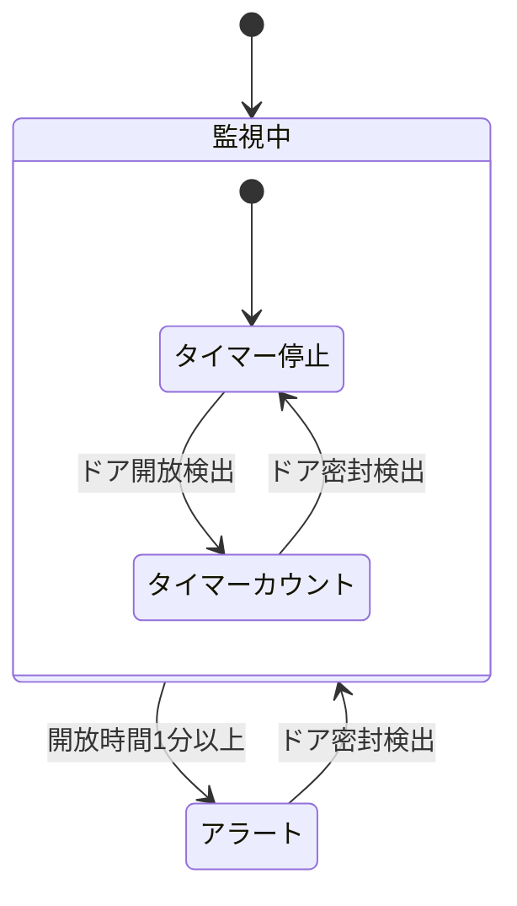

# 状態遷移

```mermaid
stateDiagram-v2
    [*] --> 監視中

    state 監視中 {
        [*] --> タイマー停止
        タイマーカウント --> タイマー停止 : ドア密封検出
        タイマー停止 --> タイマーカウント : ドア開放検出
    }

    state アラート

    監視中 --> アラート : 開放時間1分以上
    アラート --> 監視中 : ドア密封検出
```